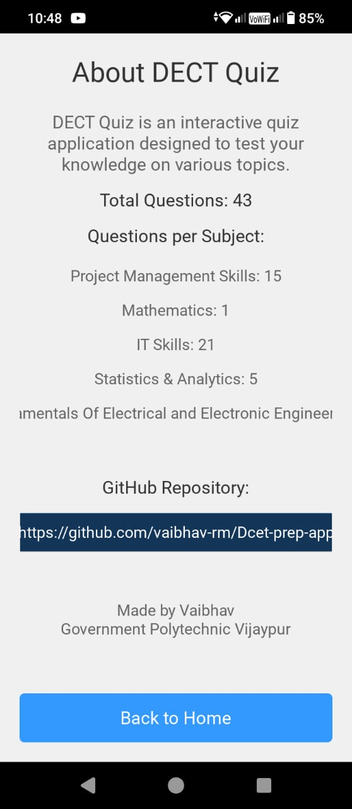

# DCET Prep App 📚🎓

Welcome to the **DCET Prep App**, a community-driven initiative to help students prepare for the **Diploma Common Entrance Test (DCET)**. Built using [Kivy](https://kivy.org/) for a smooth and intuitive cross-platform experience, this app aims to be an indispensable resource for aspirants.

---

## 📲 Features
- Interactive quiz format.
- Comprehensive question database sourced from past DCET question papers.
- Progress tracking and scoring.
- Ready for Android release.

---

## 🖼️ Screenshots
### Home Screen

### Quiz in Progress

### Result Screen

### About Screen

---

## 🛠️ Built With
- [Kivy](https://kivy.org/) for GUI and app functionality.
- Python for backend logic.
- Community-sourced content from DCET question papers.

---

## 🚧 TODO
- [x] Implement quiz functionality.
- [x] Add progress tracking.    
- [ ] Release an Android APK.
- [x] Responsive Design.
- [ ] Use database instead of reading from file.
- [ ] Login and register features for leaderboard.
- [ ] Add support for importing question papers directly into the app.
- [ ] Enhance the UI/UX for better mobile compatibility.

---

## 🙌 Contributors
Contributions of any kind are welcome!  

### Current Contributors

💡 Want to contribute? See the [Contributing Guidelines](CONTRIBUTING.md) for more information.

---

## 🚀 How to Add Your Own Questions?
Adding questions is simple! Check out [this guide](HELPING.md) for a step-by-step explanation.

---

## 📄 License
This project is licensed under the [MIT License](LICENSE).

Feel free to fork, improve, and redistribute this project!

---

## 🌟 Stay Tuned for Android Release!
This app will soon be available as an APK for Android users. Follow us for updates!
